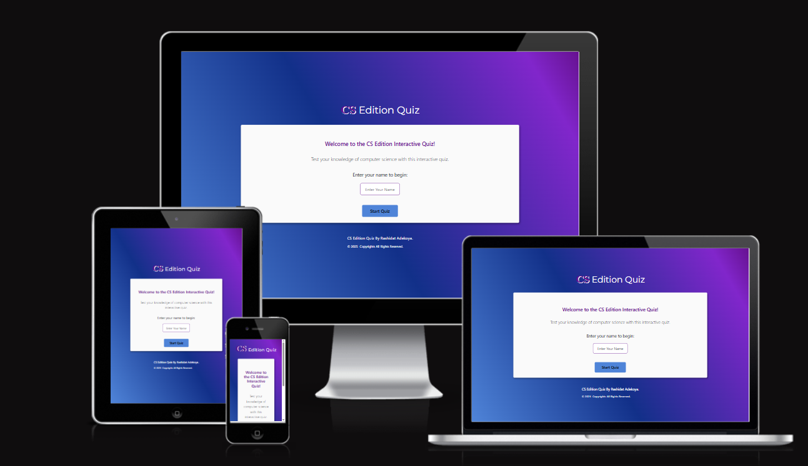
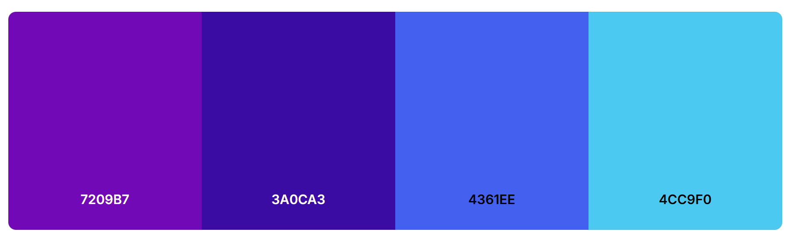

# CS-Edition-Quiz

## CS-Edition Interactive Quiz project

Welcome to the source code for **CS-Edition Interactive Quiz Edition ** An interactive, browser-based quiz that dynamically fetches questions from the Open Trivia Database (OpenTDB) covering computer science concepts; ideal for revision, self-testing and fun learning.

View the online quiz here => [CS Edition Quiz](https://shida18719.github.io/CS-Edition-Quiz/)

## CONTENTS
* [Overview](#overview)
  * [Project Goals](#project-goals)

* [Features](#features)
  * [Existing Features Across Page](#existing-features-across-page)
  * [Future Features](#future-features)

* [User Experience](#user-experience)
  * [User Stories](#user-stories)
  * [Design Structure](#design-structure)
  * [Typography and Color Scheme](#typography-and-color-scheme)

* [Technologies Used](#technologies-used)
* [Getting Started](#getting-started)

* [Credits](#credits)
* [Connect](#connect)

## Overview

CS-Edition Quiz is a lightweight, front-end web application built with HTML, CSS and JavaScript. It uses the Open Trivia API to retrieve real-time computer science–related multiple-choice questions of mixed level, tracks users’ answers, and provides instant feedback on total score.

This quiz is targeted towards individuals with the aim for learning, students, bootcamp learners, people new to tech can reinforce Computer Science theory and principles.

### Project Goals

- **To showcase Skills & Knowledge:**  
  The aim of this project is to demonstrate my skills in HTML, CSS and JavaScript for it's interactivity.

- **Responsive Design:**  
  Ensure the quiz is fully responsive and accessible on all devices (mobile, tablet, desktop).

- **Reinforce Computer Science Concept and Principles:**  
  Helps reinforce key CS concepts in a fun, interactive way

- **Modern UI/UX:**  
  Use Bootstrap5 & Custom CSS design principles, and interactive elements (like wave-animation. progress bar on timer) for a welcoming look and feel of User Interface.

- **Maintainability:**  
  Structure the codebase for easy updates, scalability, and future enhancements.

- **Accessibility:**  
  Use of color contrast and ARIA tags for better accessibility

- **Professional Presence:**  
  Learning through building and making Computer Science interactive and fun.

## Features

The quiz is comprised of 4 windows which are extended from the click of startQuiz button.

* Home page
* Greeting page
* Quiz Rule page
* Quiz Result page

### Existing Features Across Page

- **User Input Message:** User Input field which takes and stores user's name on the local storage to enable user start the quiz.

  * An error message is displayed if the username field is empty.

- **Dynamic Questions:** Fetched questions from the OpenTDB API

- **Multiple Choice Format:** A selection of computer-science themed multiple-choice and True/ False questions with a countdown timer per question.
  
  *  The correct choice turns green, while the wrong choice is red, but highlights a green button to indicate the correct answer to the user and the rest of the answer choices are disabled after an answer is chosen.  

- **Responsive Design:** Looks great on all devices using CSS/Bootstrap 5.

- **Greeting:** User's name displayed with a welcome wave on hover - achieved only on desktop devices.

- **Quiz Rules:** User is able to read the instructions about the quiz before starting.

- **Instant Result:** Displays user's name, with a personalised feedback of user's total score and the Play Again Button if user wishes to give it another go.

- **Modern UI:** Clean, accessible, and easy to navigate and works in modern browsers.

- **Social Links:** Connect via LinkedIn and GitHub.

### Future Features

- Save high scores

- Track user and manage progress

- Authentication and user management

---

## User Experience

### User Stories

- I want easily understand the goals of the website.

- I want to easily navigate the website on any device and on different screen size.

- I want the rules of the quiz to be clearly stated.

- I want to be able to improve my score.

- I want a fun and interactive way to learn CS while exercising my brain.
  
  
### Design Structure

This site was design with simplicity of colors and easy to navigate that allow for a good user experience.

All pages are clearly displayed with easy to read fonts and easily navigated with buttons.

End of questions is displayed on the last question to inform user it the end of quiz.

Give the user visual feedback as well as a personalised feel with the use of their username in the feedback comment.

### Typography and Color Scheme

### Typography

Google Fonts were used to import the chosen fonts for use in the site.

Open sans was used for the body text on this site for user experience readability, with a secondary sans-serif font.

Montserrat was used for headings on the site for readability, simple and clean looking, with a secondary of serif font.

#### Visual Effects

Font-Effect-Anaglyph was used for styling CS headings to give it a stylish Text-Shadow effect.

Hover Effect & Cursor Pointer: Buttons include a hover-over effect to make the experience more interactive and navigation more intuitive. When the user hovers over a button, its color, font-size or background color changes.

### Color Scheme

The quiz uses a Bold Hue color Gradient Palette which indicate  confidence, energy, emotions and drive user engagement.

Color palette created using the [Coolors](https://coolors.co/palette/7209b7-3a0ca3-4361ee-4cc9f0) Website

---

## Technologies used

### 1. HTML

### 2. CSS

### 3. JavaScript

## Programs & Frameworks Used

* Git - Was used for version control, to commit and push to GitHub.

* [GitHub](https://github.com/) - Was used to store the project code and display the project in GitHub Pages.

* [Coolors](https://coolors.co/) - Was used for creating a pallet of the colors used.

* [Am I Responsive?](https://ui.dev/amiresponsive) - Was used for showing how responsive design looks on different screen sizes.

* [Font Awesome](https://fontawesome.com/) - Was used to add icons to the user greeting.

* Google Dev Tools - Were used to troubleshoot the webpage as well as fix problems with responsive design and styling.

* [Google Fonts](https://fonts.google.com/) - Were used to import the fonts used on the website.

* [WebAIM](https://webaim.org/resources/contrastchecker/)- Was used for checking color contrast for accessibility.

* [OpenTrivia Database API](https://opentdb.com/api_config.php) - Is used to retrieve random questions with API integration.

---

## Getting Started

### Clone GitHub Repository

Another option is to create a local clone of the repository: 

1. Navigate to the [repository](https://github.com/Shida18719/CS-Edition-Quiz) on GitHub.
3. Locate the `Code` button at the top, above the repository file list.
4. Select a clone method, and click the `copy` button to copy the URL to your clipboard.
5. Open the IDE of your choice, and open Git Bash.
6. Change the current working direction to the location where you want to create a clone.
7. Type `git clone` and paste the URL from the clipboard.
8. `$ clone https://github.com/Shida18719/CS-Edition-Quiz`
9. Press `Enter` and the local clone will be created.

[Back to the Top](#cs-edition-interactive-quiz-project)

---

## Credits

* [Bootstrap Documentation](https://getbootstrap.com/) for a better understanding of bootstrap.

* [MDN](https://developer.mozilla.org/en-US/docs/Web/API/Window/DOMContentLoaded_event)
---

## Connect

- [LinkedIn](https://www.linkedin.com/in/rashidat-adekoya-668843245/)